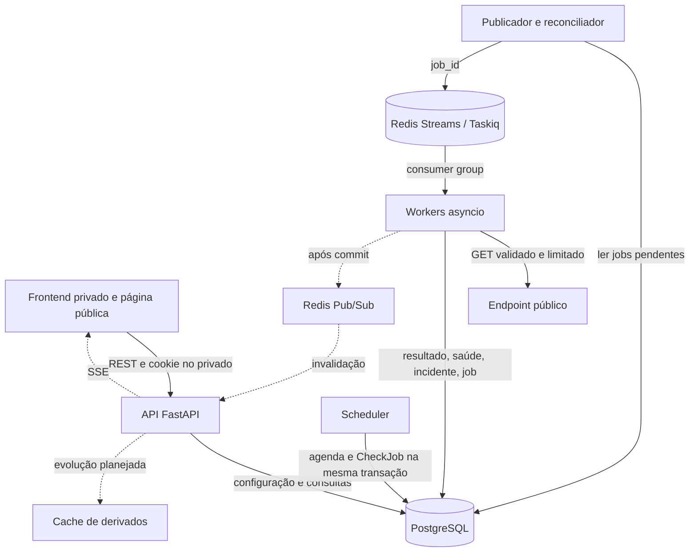
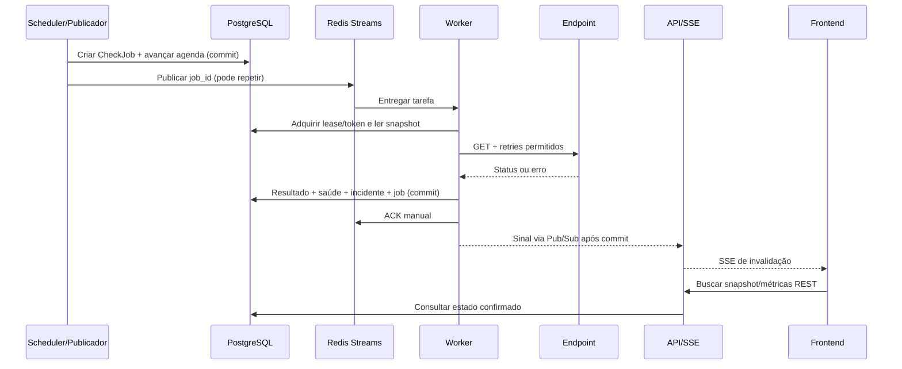

# Arquitetura

Arquitetura implementada nas fontes locais, reconciliada com o estado de desenvolvimento em 2026-10-10. Regras de saúde e métricas: [REQUIREMENTS](REQUIREMENTS.md). Fundamentação e alternativas: [DECISIONS](DECISIONS.md). Provas de integração e suas limitações estão em [OPERATIONS](OPERATIONS.md) e [DEVELOPMENT_LOG](DEVELOPMENT_LOG.md); código implementado não equivale a validação do ambiente produtivo atual.

## Estilo e componentes

Um monólito modular Python, com três tipos de processo: API, scheduler/publicador e workers. Compartilham modelos e regras, mas possuem ciclos de vida e escalabilidade independentes. O frontend é uma aplicação React separada. Não criar microserviços ou uma API intermediária para persistir checks: workers gravam diretamente no PostgreSQL usando a camada compartilhada de aplicação.

| Componente | Responsabilidade |
| --- | --- |
| React/TypeScript/Vite | Autenticação, formulários, dashboard, gráficos e status pública; consome REST/SSE |
| FastAPI | Autorização, validação, contratos REST, consultas, sessões e streams SSE |
| PostgreSQL | Contas, configuração, agenda, identidade dos jobs, resultados, estado e incidentes |
| Scheduler | Selecionar monitores vencidos, criar ciclos e avançar agenda em transações curtas |
| Publicador/reconciliador | Publicar jobs pendentes, recuperar trabalho perdido, expirar/cancelar jobs e executar manutenção limitada |
| Taskiq + RedisStreamBroker | Transporte e distribuição de tarefas entre workers, com confirmação manual |
| Worker asyncio + HTTPX | Validar destino, executar tentativas limitadas e finalizar o ciclo de forma idempotente |
| Redis Pub/Sub | Sinal efêmero de mudança após commit para instâncias da API |
| Redis cache (evolução planejada) | Métricas/snapshots derivados; consultas atuais usam PostgreSQL, sem esse cache |

Scheduler e publicador são loops do mesmo processo. Não executar esses loops no startup de cada réplica FastAPI. A retenção possui execução dedicada e limitada; não é tarefa automática do startup da API. O perfil gratuito usa também um executor batch separado, descrito abaixo.



## Estrutura do repositório

As fronteiras de responsabilidade atuais são:

```text
backend/
  app/
    api/             # rotas, DTOs, autenticação de requests e SSE
    domain/          # validação e regras de domínio
    services/        # casos de uso, consultas, sinais e transações
    db/              # modelos, sessões e retenção
    monitoring/      # scheduler, publicador, tarefas, batch e transporte seguro
    config.py        # configuração validada por ambiente
    security.py      # credenciais e sessões
    observability.py # atividade estruturada e sanitizada
  tests/
  migrations/        # Alembic, head 0003_legal_acceptances
frontend/src/        # páginas e módulos de produto
scripts/             # operação e ensaios de integração
infra/               # perfis cloud e controles de egress
docs/
```

Não criar abstrações genéricas de repository/unit-of-work para cada tabela antes de existir necessidade. Funções de domínio devem ser testáveis sem FastAPI, Redis ou chamadas externas. AsyncSession e AsyncClient devem ter escopo definido; não compartilhar uma sessão SQLAlchemy entre tarefas concorrentes.

## Identidade e fluxo de um ciclo

1. Scheduler consulta monitores ativos com `next_check_at <= now()`, em lotes de até 100, a cada aproximadamente 1 s.
2. Em transação curta, bloqueia o monitor, revalida estado/versão, registra `CheckJob` e avança `next_check_at`. Restrição única identifica `(monitor_id, config_version, scheduled_at)`; índice parcial impede dois jobs abertos para um monitor.
3. O job contém snapshot imutável das regras, `scheduled_at`, `expires_at` e orçamento B. Agenda e intenção persistida são atômicas no PostgreSQL.
4. Publicador lê jobs elegíveis e envia somente `job_id` e versão do envelope ao Taskiq. Depois registra `published_at`. Se morrer entre envio e registro, pode publicar novamente: isso é esperado.
5. Worker carrega o job e adquire lease/token em transação. Trabalho concluído/cancelado é reconhecido; lease ainda ocupado impede execução duplicada. Antes de HTTP, conferir configuração, prazo e destino novamente.
6. Worker executa GET e retries dentro do orçamento, usando relógio monotônico. Não mantém conexão/transação SQL aberta durante I/O externo.
7. Ao finalizar, nova transação bloqueia os recursos, revalida lease, prazo, estado e versão. Insere um CheckResult por job, altera saúde/contadores/incidente, conclui job e incrementa revisão do projeto.
8. Somente depois do commit confirma a mensagem. Publica sinal Pub/Sub por melhor esforço; uma falha desse sinal não desfaz o resultado nem força repetir HTTP.
9. API recebe o sinal, encaminha SSE ao proprietário; frontend refaz consultas afetadas. Banco continua sendo a fonte de verdade.



## Scheduling e concorrência

- Agenda de taxa fixa em UTC, baseada no slot previsto, e não em `conclusão + intervalo`. Primeiro check ocorre logo após cadastro/retomada, com jitter inicial de até 5 s.
- Após atraso, escolher apenas o slot mais recente já vencido: `slot = next_check_at + floor((now-next_check_at)/interval)*interval`. Registrar `skipped_slots`; avançar para `slot + interval`. Não disparar uma rajada para tentar medir o passado.
- Um job em aberto por monitor. Jobs vencidos são invalidados antes de liberar o próximo slot. Pausa, alteração e arquivamento invalidam trabalho anterior.
- `expires_at = scheduled_at + interval_seconds`. Iniciar somente se ainda houver orçamento B completo antes de expirar; não encurtar timeout configurado e atribuir essa falha ao alvo. Resultado entregue fora do prazo não altera saúde.
- Inicialmente um scheduler. Row locks, restrições únicas e seleção com `FOR UPDATE SKIP LOCKED` permitem evolução para múltiplos schedulers; isso exigirá teste de concorrência, não apenas aumentar réplicas.
- Workers com limite inicial de 50 ciclos simultâneos por processo, pool HTTP compatível, limite local de 5 requisições concorrentes por host e limite de conexões DB independente. Limite por host é local; proteção global dependerá de egress e cotas, não é garantida com múltiplos workers.
- Usar sempre locks na ordem Project (quando necessário), Monitor, CheckJob. Scheduler não precisa alterar Project. Transações pequenas; retry limitado de deadlock e nenhuma espera HTTP segurando locks.

Não prometer execução exactly-once. Uma queda após envio HTTP, ou um lease expirado, pode gerar um GET extra. A garantia de projeto é um efeito persistido por ciclo; só GET sem efeitos esperados é permitido.

## Fila, leases e reconciliação

Redis Streams distribui trabalho com um consumer group, nomes únicos de consumidores e ACK manual. Inicializar o grupo desde o início do stream (`0-0`) para não ignorar jobs publicados antes do primeiro worker. Não habilitar trimming por tamanho que possa remover mensagens não consumidas ou pendentes.

Configuração inicial planejada: lease de 90 s, orçamento B ≤50 s, limite externo de execução de 55 s e reclaim do broker após 120 s de idle. Lease protege a finalização; `expires_at` pode cancelar o job antes do lease terminar. Limites serão confirmados no experimento da Fase 1.

O reconciliador, usando token/revisão condicional:

- Republica jobs pending sem publicação ou sem claim após 30 s; aceita mensagens duplicadas.
- Recupera running com lease expirado, caso ainda haja orçamento e prazo; incrementa a geração do lease.
- Expira jobs sem prazo suficiente e registra o motivo operacional, sem falha do alvo.
- Ao tratar erro interno recuperável, agenda reexecução técnica após 1 s e 2 s; permite até 3 execuções técnicas no total e sempre respeita o prazo.
- Ao esgotar execuções, marca `exhausted` com código sanitizado. Esses jobs formam a lista persistente de falhas operacionais; não criar uma segunda DLQ Redis no MVP.

Não usar ao mesmo tempo middleware genérico de retries Taskiq e a política técnica persistida, pois multiplicaria tentativas. Se banco está inacessível, não confirmar a mensagem: broker/reconciliador recuperam depois. Mensagem duplicada com lease ocupado pode ser confirmada, pois o registro durável continua permitindo recuperação. Mensagens malformadas são registradas de forma sanitizada e retiradas, com alerta operacional.

ACK não significa necessariamente sucesso do alvo: inclui resultado failure ou término operacional já registrado. Jobs são persistidos por 30 dias; depois da limpeza, mensagem antiga sem job é descartada. Limpeza de stream só remove entradas confirmadas e já ultrapassadas pelo grupo; medir backlog e pendências, não apenas o tamanho bruto do stream.

## Retries de alvo e falhas do Vigil

Há duas políticas distintas:

| Política | Quando | Efeito |
| --- | --- | --- |
| Retry HTTP do ciclo | Erro transitório de rede/timeout ou 5xx inesperado | Até 2 extras, backoff com jitter; apenas um resultado final |
| Reexecução técnica do job | Crash, erro interno recuperável, falha de persistência | Mesmo job, lease/token e limite de execuções; não é uma nova amostra |

HTTP 4xx/3xx inesperado e TLS inválido são falhas sem retry. Destino proibido ou pool local esgotado são problemas internos/de política; não computam indisponibilidade do cliente. HTTPX separa timeouts de conexão/leitura/escrita/pool; envolver cada tentativa também em deadline total, pois timeout de leitura isolado não limita toda a operação.

Uma finalização interna registrada interrompe sequência de falhas sem recuperar offline. Cancelamento por pausa/configuração tem as regras administrativas de REQUIREMENTS. Falhas do banco podem impedir até esse registro; então a API informa freshness e operação mede atraso/backlog.

## PostgreSQL, estado e métricas

Resultado, contador de falhas, abertura/encerramento de incidente e término do job pertencem à mesma transação. Monitor guarda snapshot atual para dashboard; CheckResult guarda histórico imutável. O contrato preserva `started_at`, `detected_at` e `ended_at`, distinguindo observação, confirmação e encerramento administrativo.

Métricas iniciais são consultas PostgreSQL indexadas por monitor/tempo, com janelas de até 30 dias. Média e p95 são calculados sobre sucessos, e uptime sobre ciclos finais avaliados. Projeto agrega amostras, sem fazer média de percentis. Retornar contadores e `computed_at`; gaps não viram uptime 100%.

CheckJob faz também o papel de outbox de execução, evitando uma tabela genérica de eventos. Não há outbox para SSE no MVP: eventos visuais não são críticos porque snapshots são reconciliados. Alertas futuros exigirão entrega durável própria.

## Redis e evolução do cache

O perfil local usa Redis para fila e Pub/Sub; o Compose configura AOF e `noeviction`. O perfil gratuito desabilita Redis. Cache de métricas/snapshots ainda não está implementado: leituras de observações consultam PostgreSQL. Uma futura camada de cache deve limitar TTL a 15 s e ter orçamento de memória; `noeviction` pode rejeitar escritas, por isso falha de cache deve ser ignorável e erro de enfileiramento recuperável pelo PostgreSQL.

Fila não usa Pub/Sub. Pub/Sub não substitui histórico nem entrega durável. Escalar/cachear não exige Redis Cluster ou Sentinel no MVP; se caches ameaçarem a fila, separar instâncias é a primeira evolução.

No desenho futuro, cachear apenas métricas/snapshots derivados. A chave deve incluir proprietário/projeto, janela, filtros e `Project.revision`, consultada no banco; mudanças relevantes já incrementam revisão. Freshness deve ser recalculada na leitura, mesmo quando o agregado estiver em cache. Estado atual do monitor e autorização não dependem de cache. Eventos invalidam UI; TTL/revisão devem impedir depender exclusivamente de invalidação efêmera.

## Comunicação em tempo real

SSE atende ao fluxo servidor → navegador; todas as mutações continuam REST. Uma conexão privada por aba recebe eventos do usuário, com no máximo 3 conexões simultâneas por conta por processo API. O limite não é global entre réplicas.

- Usar cookie de sessão no mesmo origin; não colocar tokens na URL.
- Evento `snapshot.required` no início/reconexão e a cada 30 s; frontend assina primeiro e então busca estado para reduzir a janela de corrida.
- Eventos `monitor.updated`, `incident.opened`, `incident.closed` e `project.updated` levam IDs/revisão, não resultados inteiros.
- Heartbeat a cada 15 s; verificar validade/revogação da sessão antes do primeiro sinal e a cada 30 s, encerrando ao invalidar. Revalidações periódicas do stream não renovam `last_seen_at`; abertura/reconexão usa a autenticação comum e pode registrar atividade. Logout fecha a conexão na UI.
- Sem replay durável nem garantia de ordem completa; refetch aceita a revisão mais nova. Polling REST a cada 30 s durante desconexão.
- Queues locais limitadas por conexão; consumidor lento recebe solicitação de snapshot ou é desconectado, sem memória ilimitada.
- Reverse proxy precisa desativar buffering SSE, permitir conexões longas e preferir HTTP/2. Público usa polling de 30 s no MVP.

## Segurança do monitoramento

SSRF é risco estrutural, não validação opcional de formulário. Antes de qualquer GET:

1. Parsear e normalizar URL; permitir só esquemas/portas previstas; rejeitar userinfo, fragmentos e formatos ambíguos.
2. Resolver A/AAAA com limite de tempo; rejeitar localhost, IPs privados, link-local, metadados, multicast, não especificados e demais faixas não públicas, inclusive IPv4 mapeado em IPv6. Rejeitar se qualquer endereço retornado for proibido.
3. Conectar somente a IP já validado, preservando Host e SNI/TLS. Não validar DNS e deixar o cliente resolver novamente: isso reabre a corrida de rebinding. Pools por destino só reutilizam conexões verificadas.
4. Desativar redirects e proxies herdados do ambiente, verificar TLS, limitar headers e não baixar body. Cancelar/fechar resposta após headers finais.
5. Aplicar controles de egress aos workers: negar rede interna, rede de controle, PostgreSQL/Redis como destinos HTTP e metadados, permitindo separadamente conexões necessárias de infraestrutura.

`backend/app/monitoring/transport.py` implementa `SafeTransport` sobre httpcore com resolução fixada: valida todos os endereços A/AAAA por conexão, conecta ao IP autorizado e confere o peer, preservando hostname para Host/SNI e validação TLS com certifi. Keepalive e retries do transporte são desativados; retries pertencem ao executor. Cada tentativa HTTPX usa `trust_env=false`, redirects desativados e leitura até headers finais. O firewall do worker complementa essa política. Testes determinísticos e sockets TLS IPv4/IPv6 possuem provas históricas em OPERATIONS; o ambiente alvo continua exigindo validação própria antes de habilitar execução externa.

Logs não guardam URL completa/query, body, cookie, senha ou erro remoto bruto. Jobs contêm configuração no banco e apenas IDs no Redis. Cadastro/login, criação de monitores, métricas caras e leituras públicas recebem rate limiting com resposta 429. Política de abertura do cadastro precisa ser resolvida antes do deploy público.

## Autenticação e exposição

Sessão opaca aleatória em cookie `__Host-vigil_session`, HttpOnly, Secure, SameSite=Lax e Path=/ em produção; PostgreSQL guarda hash do token e estado revogável. Sessão expira após 24 h de inatividade ou 7 dias absolutos. Senha usa Argon2id por biblioteca especializada. Não usar JWT/localStorage sem necessidade.

Frontend e API sob um origin no deploy; Vite deverá usar proxy de desenvolvimento. Mutações exigem Origin autorizado; cadastro/login exigem JSON e header `X-Vigil-Request: browser`; demais mutações também exigem token CSRF sincronizado da sessão. SameSite não substitui essas verificações. SSE e DTOs públicos possuem autorização/exposição próprias.

## Perfil gratuito e executor batch

O perfil em [FREE_CLOUD](FREE_CLOUD.md) serve frontend/API no Render, persiste em schema Neon privado e executa rodadas pelo GitHub Actions, disparadas também por cron Cloudflare. `backend/app/monitoring/batch.py` compartilha jobs, claims, finalização e transporte seguro com o pipeline, sem broker/Redis/Taskiq. Defaults: prazo de rodada 90 s, cinco execuções simultâneas e até cem jobs. O runner aplica proteção de egress e gates explícitos; a API permanece sem executar checks.

O mínimo cloud é 900 s e a agenda é best-effort, sem SLA de quinze minutos. A admissão respeita intervalo e orçamento; uma espera acumulada de até 30 s permite o primeiro ciclo futuro próximo somente quando não há trabalho aberto. Slots omitidos não viram medições retroativas. Sem Redis, resultados do runner chegam à UI por reconciliação REST/polling; sinais locais continuam úteis para mutações da própria API.

## Operação, falhas e escala

| Falha | Comportamento esperado |
| --- | --- |
| API indisponível | Checks podem continuar; dashboard reconecta depois |
| Scheduler indisponível | Checks deixam de ser criados; freshness/atraso revelam lacuna; recuperação pula slots antigos |
| Redis indisponível/perde dados | Jobs persistidos são republicados dentro do prazo; sinais SSE podem sumir |
| Worker cai antes do commit | Lease/reconciliação recuperam ou expiram; pode haver GET repetido |
| Worker cai depois do commit, antes do ACK | Reentrega encontra job concluído e não reaplica resultado |
| PostgreSQL indisponível | Sem nova agenda/finalização; não ACK sem registro; nenhuma falsa falha geral dos alvos |
| Frontend perde SSE | Snapshot/polling recuperam visualização |
| Volume excede capacidade | Backpressure, cotas, expiração de jobs e alerta de atraso; não acumular checks históricos indefinidamente |

A atividade implementada em `backend/app/observability.py` registra eventos JSON sanitizados com IDs e durações. O diagnóstico `app.monitoring.status` consulta jobs/fila sem mutação; não é endpoint público. Histogramas históricos, exporter e alertas permanecem evoluções, sem promessa de que logs isolados cumpram todo RNF010. Labels métricos futuros não devem conter URL ou monitor_id de alta cardinalidade; esses IDs ficam nos logs.

O scheduler/publicador contínuo grava heartbeat por par stream/group, com clock Redis, atualização Lua atômica e TTL de 120 s. Última tentativa e último sucesso são separados; erro não apaga sucesso. A escrita tem prazo de 1 s e falhas permitem o próximo tick. O diagnóstico consulta cada fonte com prazo de 3 s, lê sem renovar TTL e informa stale após 5 s. Esses estados não provam saúde de cada worker/processo nem se aplicam à cadência do executor cron gratuito. Probes da API não dependem dessa chave.

API oferece `/health/live` e `/health/ready`; saúde do pipeline é observada separadamente por heartbeats, sem amarrar liveness a cada dependência. Backup/restore PostgreSQL e recuperação Redis serão testados antes do deploy.

Estimativa: 100 monitores a cada minuto geram 144.000 ciclos/dia e 4,32 milhões/30 dias; 1.000 geram 43,2 milhões/30 dias. Medir tamanho real com índices e tentativas. Retenção em lotes é suficiente inicialmente; particionamento e agregações são evolução motivada por dados.

Escala progressiva: aumentar capacidade/concurrency medida → adicionar workers → separar Redis cache/fila → adicionar réplicas da API → avaliar múltiplos schedulers → agregações/partições. Não introduzir Kubernetes ou brokers adicionais para demonstrar escala sem uma demanda medida.
