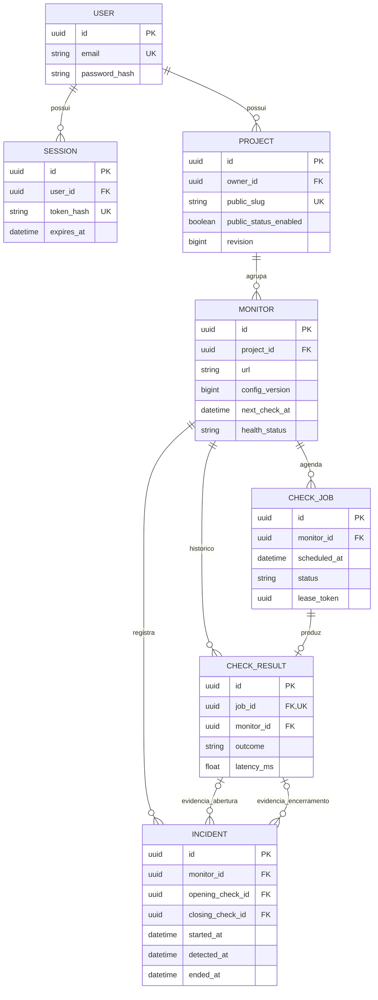

# Modelo de dados inicial

Proposta para PostgreSQL; não contém SQL executável nem migrations. Semântica: [REQUIREMENTS](REQUIREMENTS.md). API e workers compartilharão a camada de persistência.

## Convenções

- PKs UUID, exceto quando um identificador natural já cumpre função própria. Datas `timestamptz` em UTC.
- Durações/latências em ms, intervalos em segundos; usar nomes que explicitem unidades.
- Textos de enum podem ser implementados com `CHECK` ou enum PostgreSQL na fase de migrations; contratos já definem valores permitidos.
- `created_at/updated_at` nos registros mutáveis; resultados são imutáveis após finalização.
- IDs enviados pelo cliente não permitem alterar owner/FKs; a autorização deriva de `Project.owner_id`.
- Índices abaixo são propostas mínimas, a validar com consultas reais. Não indexar cada campo nem todo JSONB.

## Entidades necessárias

As cinco entidades do domínio são User, Project, Monitor, CheckResult e Incident. Acrescentam-se **Session**, para autenticação revogável, e **CheckJob**, para identidade do ciclo e publicação recuperável. Não são necessárias tabelas Service, Team, Alert, StatusPage, Metric ou CheckAttempt no MVP.

### User — `users`

Responsabilidade: identidade e credenciais da conta.

| Campo | Tipo planejado | Observação |
| --- | --- | --- |
| `id` | UUID PK | Identificador da conta |
| `email` | varchar(254) | Normalizado/único; não remover pontos ou reinterpretar provedores |
| `password_hash` | text | Argon2id; nunca exposto pela API |
| `is_active` | boolean | Bloqueio operacional de acesso |
| `created_at`, `updated_at` | timestamptz | Auditoria básica |

Relacionamentos: 1:N Project e Session. Índice único em e-mail normalizado. Operações de criação sujeitas a cotas bloqueiam a linha User para evitar criação concorrente acima do limite.

### Session — `sessions`

Responsabilidade: sessão de navegador revogável sem JWT.

| Campo | Tipo planejado | Observação |
| --- | --- | --- |
| `id` | UUID PK | ID interno, não é a credencial |
| `user_id` | UUID FK | Proprietário |
| `token_hash` | bytea/text único | Hash criptográfico do token aleatório do cookie; token bruto não persistido |
| `csrf_token` | text | Token aleatório sincronizado; não autentica sozinho |
| `created_at`, `last_seen_at` | timestamptz | Atividade; atualização de last_seen limitada, por exemplo a cada 5 min |
| `expires_at` | timestamptz | Prazo absoluto de 7 dias |
| `revoked_at` | timestamptz nullable | Logout/revogação |

Inatividade de 24 h também invalida sessão. Índices: único `token_hash`, `(user_id, revoked_at)` e `expires_at` para limpeza. Relação N:1 User; remover sessões expiradas/revogadas após 7 dias. Sem IP/user-agent persistidos no MVP.

### Project — `projects`

Responsabilidade: agrupar endpoints e controlar publicação da página de status.

| Campo | Tipo planejado | Observação |
| --- | --- | --- |
| `id` | UUID PK | Identificador privado |
| `owner_id` | UUID FK | Usuário dono; imutável no MVP |
| `name` | varchar(100) | Nome de exibição |
| `description` | varchar(500) nullable | Descrição privada; não publicada automaticamente |
| `public_slug` | varchar(80) único | Gerado pelo servidor com sufixo aleatório; estável no MVP, não é autenticação |
| `public_status_enabled` | boolean default false | Habilita leitura pública |
| `revision` | bigint default 0 | Incremento em mudanças relevantes e resultados; chave de cache/eventos |
| `archived_at` | timestamptz nullable | Arquivamento lógico |
| `created_at`, `updated_at` | timestamptz | Auditoria |

Relacionamentos: N:1 User; 1:N Monitor. Índices: `(owner_id, created_at, id)` para listas de ativos e único `public_slug`. Incidentes e checks se vinculam ao projeto através de Monitor, sem `project_id` redundante.

### Monitor — `monitors`

Responsabilidade: configuração, agenda e snapshot atual de um endpoint.

| Campo | Tipo planejado | Observação |
| --- | --- | --- |
| `id` | UUID PK | Identificador |
| `project_id` | UUID FK | Projeto; imutável no MVP |
| `name` | varchar(100) | Nome de exibição |
| `url` | varchar(2048) | Privada; sem credenciais ou secrets |
| `method` | text | GET fixo |
| `interval_seconds` | integer | 60–3.600 |
| `timeout_ms` | integer | 1.000–15.000 |
| `expected_status` | smallint | 200–599 |
| `failure_threshold` | smallint | 1–10 |
| `retry_count` | smallint | 0–2 extras |
| `latency_threshold_ms` | integer nullable | Nulo desativa degradação por latência |
| `config_version` | bigint | Monotônico; invalida jobs após edição de check, pausa ou arquivamento |
| `paused_at`, `archived_at` | timestamptz nullable | Estados administrativos separados da saúde |
| `is_public` | boolean default false | Opt-in por monitor |
| `next_check_at` | timestamptz nullable | Agenda; nulo se pausado/arquivado |
| `health_status` | text nullable | online/degraded/offline; nulo sem medição válida |
| `consecutive_failures` | integer default 0 | Sequência de ciclos finais falhos |
| `first_failure_at` | timestamptz nullable | Início observado da sequência atual |
| `last_checked_at` | timestamptz nullable | Conclusão do último ciclo avaliado |
| `last_scheduled_at` | timestamptz nullable | Slot do último resultado aplicado |
| `last_http_status` | smallint nullable | Status final, se obtido |
| `last_latency_ms` | double precision nullable | Última tentativa medida; não inventar valor em timeout |
| `last_outcome` | text nullable | success/failure |
| `last_error_code` | text nullable | Código sanitizado de falha do alvo |
| `last_degradation_reason` | text nullable | failure_pending/retry_recovered/high_latency ou nulo |
| `created_at`, `updated_at` | timestamptz | Auditoria |

Relacionamentos: N:1 Project; 1:N CheckJob, CheckResult e Incident. `freshness` é calculada na leitura, nunca coluna fixa dependente do tempo. Snapshot permanece mesmo após retenção do resultado original; após editar regras de check, zerar snapshot/contadores conforme RN014.

Índices: `(project_id, created_at, id)`; índice parcial em `(next_check_at, id)` para não pausados/não arquivados; índice por projeto dos monitores públicos se necessário. Não há restrição de URL única: o usuário pode monitorar a mesma URL com regras distintas dentro das cotas.

### CheckJob — `check_jobs`

Responsabilidade: representar intenção de check, controlar execução e cobrir a lacuna entre commit PostgreSQL e publicação Redis. Funciona como outbox específica de monitoramento.

| Campo | Tipo planejado | Observação |
| --- | --- | --- |
| `id` | UUID PK | Identidade usada no envelope da fila |
| `monitor_id` | UUID FK | Monitor |
| `config_version` | bigint | Versão que originou o ciclo |
| `config_snapshot` | JSONB | URL, método e regras; schema validado, imutável, privado |
| `scheduled_at`, `expires_at` | timestamptz | Slot previsto e prazo final do ciclo |
| `budget_ms` | integer | Orçamento B calculado ao criar |
| `skipped_slots` | integer default 0 | Slots omitidos pelo scheduler antes deste job |
| `status` | text | pending/running/completed/expired/cancelled/exhausted |
| `published_at` | timestamptz nullable | Último envio ao broker; não é garantia de processamento |
| `retry_at` | timestamptz nullable | Momento da próxima reexecução técnica permitida |
| `lease_token` | UUID nullable | Dono/generação para finalização condicional |
| `lease_expires_at` | timestamptz nullable | Validade do lease |
| `execution_count` | smallint default 0 | Máximo 3 execuções técnicas iniciadas |
| `started_at`, `finished_at` | timestamptz nullable | Início da execução atual e término |
| `error_code` | text nullable | Motivo operacional sanitizado de término/falha |
| `created_at`, `updated_at` | timestamptz | Auditoria |

Relacionamentos: N:1 Monitor; 1:0..1 CheckResult. Somente ciclos efetivamente avaliados têm resultado; expired/cancelled/exhausted não fabricam CheckResult de failure. A lista de exhausted é o registro operacional de jobs problemáticos do MVP.

Índices/constraints importantes:

- Único `(monitor_id, config_version, scheduled_at)`.
- Único parcial em `monitor_id` para `status IN (pending, running)`.
- Índice parcial `(retry_at, published_at, scheduled_at)` para pending; validar estratégia com query real.
- Índice parcial `(lease_expires_at)` para running e `(expires_at)` para jobs em aberto.
- `(monitor_id, scheduled_at, id)` para diagnóstico/métricas de lacunas; `finished_at` para retenção.

Finalização só ocorre com token e versão ainda válidos. Pausa/edição/expiração cancela ou expira job e invalida token na mesma transação. Não depender de um lock Redis como prova de posse.

### CheckResult — `check_results`

Responsabilidade: histórico imutável do resultado final de um ciclo avaliado.

| Campo | Tipo planejado | Observação |
| --- | --- | --- |
| `id` | UUID PK | Identificador do resultado |
| `job_id` | UUID FK único | Um resultado por ciclo |
| `monitor_id` | UUID FK | Consulta direta por monitor; deve corresponder ao job |
| `config_version` | bigint | Versão avaliada |
| `scheduled_at` | timestamptz | Base temporal das métricas |
| `started_at`, `completed_at` | timestamptz | Execução efetiva |
| `outcome` | text | success/failure; problemas internos ficam no job |
| `http_status` | smallint nullable | Último status final obtido |
| `latency_ms` | double precision nullable | Tempo até headers da última tentativa, se houve resposta |
| `cycle_duration_ms` | double precision | Tempo total, incluindo retries/backoff, sem fila |
| `queue_delay_ms` | double precision | `started_at - scheduled_at` |
| `attempt_count` | smallint | 1–3 na execução técnica que produziu este resultado |
| `attempts` | JSONB | Lista limitada de status/erro, latência e duração por tentativa |
| `error_code` | text nullable | timeout/dns_error/connection_error/tls_error/unexpected_status |
| `health_after` | text | Saúde derivada após aplicar resultado |
| `degradation_reason` | text nullable | Causa principal, priorizando retry_recovered antes de high_latency |

Tentativas não contêm body, URL, IP detalhado, headers ou erro remoto bruto. Se uma execução técnica anterior caiu, seus GETs podem não ter sido registrados; `attempt_count` não promete contar todas as chamadas físicas feitas em uma queda.

Relacionamentos: N:1 Monitor e 1:1 CheckJob quando há resultado. Índices: único job_id; `(monitor_id, scheduled_at DESC, id DESC)` para histórico e métricas; `completed_at` para retenção. Sem tabela Metric inicial e sem índice JSONB automático. Corresponder monitor/job via FK composta ou validação transacional; escolher no desenho das migrations e testar.

### Incident — `incidents`

Responsabilidade: registrar períodos de indisponibilidade confirmada e distinguir recuperação de encerramento administrativo.

| Campo | Tipo planejado | Observação |
| --- | --- | --- |
| `id` | UUID PK | Identificador |
| `monitor_id` | UUID FK | Monitor afetado |
| `started_at` | timestamptz | Início da primeira falha da sequência |
| `detected_at` | timestamptz | Conclusão do ciclo que atingiu offline |
| `ended_at` | timestamptz nullable | Conclusão de recuperação ou momento administrativo |
| `end_reason` | text nullable | recovered/configuration_changed/archived |
| `opening_check_id`, `closing_check_id` | UUID FK nullable | Evidência; `ON DELETE SET NULL` após retenção |
| `cause_code` | text | Código sanitizado da falha que confirmou offline |
| `failure_threshold_snapshot` | smallint | Threshold aplicado à abertura |
| `created_at`, `updated_at` | timestamptz | Auditoria |

Aberto é `ended_at IS NULL`; não duplicar essa condição em um campo status mutável. Restrição única parcial `(monitor_id) WHERE ended_at IS NULL`. Índices `(monitor_id, started_at DESC, id DESC)` e `ended_at` para retenção. Ordenação temporal deve respeitar `started_at <= detected_at <= ended_at` quando encerrado; timestamps de execução/administrativos devem seguir a mesma base temporal.

Não haverá IncidentUpdate ou incidentes manuais no MVP. Duração observada pode incluir uma pausa/lacuna; API indica que não é tempo exato comprovado de downtime. FK de evidência pode ficar nula sem perder os timestamps/códigos históricos.

## Diagrama ER

## Integridade, retenção e volume

- Scheduler cria job e avança agenda juntos. Worker grava resultado/saúde/incidente/término juntos. API cancela jobs e aplica alterações administrativas juntos.
- Arquivamento é lógico, sem cascade de histórico. Projetos/monitores arquivados deixam de ser públicos e deixam as consultas normais. Não criar restauração/hard delete nesta versão.
- Limpar checks concluídos com mais de 30 dias antes de limpar seus jobs; incidentes mantêm evidências nullable. Job ainda referenciado por resultado não é apagado primeiro.
- Incidentes encerrados expiram 90 dias após `ended_at`; abertos e snapshots não expiram. Sessions inválidas expiram após 7 dias.
- Deletar em pequenos lotes, monitorar locks/bloat e garantir índices para manutenção. Não prever partições/migrations agora; avaliar ao medir milhões de linhas e duração da limpeza.
- Remoção de conta e exigências específicas de retenção/privacidade precisam de política antes de um serviço público comercial; não são endpoints já definidos.

## Dados derivados

Freshness, status agregado, uptime, média, p95 e série temporal são calculados. Snapshot atual e incidentes são persistidos porque servem à transição de estado e leitura eficiente. Cache Redis é descartável e nunca substitui essas regras.

Métricas de qualidade usam jobs distintos: `excluded_count` é quantidade de expired/exhausted na janela; `cancelled_count` é separado; `pending_count` conta jobs em aberto; `skipped_slots` soma os skips registrados. Esses valores ajudam a revelar lacunas, mas não representam uma cobertura temporal completa de períodos sem scheduler.
